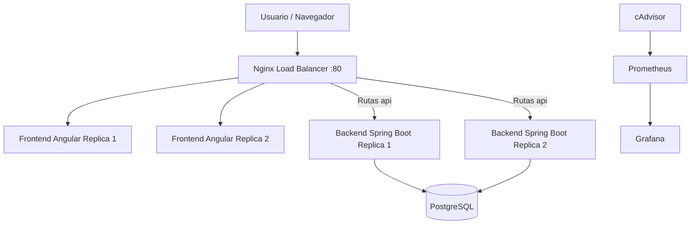

# Proyecto-Sistemas-Operativos2
Aplicación web completamente funcional bajo la arquitectura de microservicios, aplicando los conceptos de contenerización, orquestación y balanceo de carga

## Descripción
Aplicación web de gestión académica desplegada bajo arquitectura de microservicios usando Angular, Spring Boot, PostgreSQL, Nginx, Docker Swarm, Prometheus y Grafana.

## Tecnologías utilizadas
- Angular
- Spring Boot
- PostgreSQL
- Nginx
- Docker
- Docker Swarm
- Prometheus
- Grafana
- cAdvisor
- Docker Hub

## Estructura del proyecto
- frontend/: aplicación Angular.
- backend/: API REST Spring Boot.
- nginx/: configuración del balanceador de carga.
- prometheus/: configuración de monitoreo.
- stack.yml: definición del stack para Docker Swarm.
-

## Arquitectura
- **Nginx**: balanceador de carga y punto de entrada único de la aplicación.
- **Frontend**: Angular servido con Nginx, 2 réplicas.
- **Backend**: API REST desarrollada con Spring Boot, 2 réplicas.
- **PostgreSQL**: base de datos relacional con volumen persistente.
- **Prometheus**: recolección de métricas.
- **Grafana**: visualización de métricas.
- **cAdvisor**: métricas de contenedores.
- **Docker Swarm**: orquestación de servicios, réplicas, redes y escalado.

## Diagrama de arquitectura

Usuario
↓
Nginx Load Balancer :80
↓
Frontend Angular x2
↓
Nginx /api/
↓
Backend Spring Boot x2
↓
PostgreSQL

Prometheus + cAdvisor + Grafana monitorean los contenedores.



## Servicios del stack
| Servicio | Imagen | Réplicas | Puerto |
|---|---|---:|---|
| nginx | nginx:1.29-alpine | 1 | 80 |
| frontend | javil1/frontend-siso2:1.0 | 2 | Interno |
| backend | javil1/backend-siso2:1.0 | 2 | Interno 9090 |
| postgres | postgres:17-alpine | 1 | Interno |
| prometheus | prom/prometheus:latest | 1 | 9090 |
| grafana | grafana/grafana:latest | 1 | 3000 |
| cadvisor | gcr.io/cadvisor/cadvisor:latest | global | Interno |

## Requisitos
- Docker Desktop instalado.
- Docker Swarm inicializado.
- Imágenes del frontend y backend publicadas en Docker Hub.
- Puerto `80` disponible para la aplicación.
- Puerto `3000` disponible para Grafana.
- Puerto `9090` disponible para Prometheus.

## Imágenes utilizadas
Frontend:
```bash
javil1/frontend-siso2:1.0
```

Backend:
```bash
javil1/backend-siso2:1.0
```

## Despliegue
Inicializar Docker Swarm:

```bash
docker swarm init
```

Desplegar el stack:
```bash
docker stack deploy -c stack.yml proyecto
```

Verificar servicios:
```bash
docker stack services proyecto
```

Resultado esperado:
```txt
NAME                  MODE         REPLICAS   IMAGE
proyecto_backend      replicated   2/2        javil1/backend-siso2:1.0
proyecto_frontend     replicated   2/2        javil1/frontend-siso2:1.0
proyecto_nginx        replicated   1/1        nginx:1.29-alpine
proyecto_postgres     replicated   1/1        postgres:17-alpine
proyecto_prometheus   replicated   1/1        prom/prometheus:latest
proyecto_grafana      replicated   1/1        grafana/grafana:latest
proyecto_cadvisor     global       1/1        gcr.io/cadvisor/cadvisor:latest
```

## Acceso a la aplicación
Desde la máquina local:

```txt
http://127.0.0.1
```

## Acceso a Prometheus

Prometheus está disponible en:

```txt
http://127.0.0.1:9090
```

Prometheus no requiere usuario ni contraseña en esta configuración.

Uso principal:

- Verificar targets.
- Consultar métricas.
- Revisar si cAdvisor está entregando métricas correctamente.

Ruta recomendada dentro de Prometheus:

```txt
Status → Targets
```

## Acceso a Grafana

Grafana está disponible en:

```txt
http://127.0.0.1:3000
```

Credenciales configuradas en el stack:

```txt
Usuario: admin
Contraseña: admin123
```

## Acceso a cAdvisor
cAdvisor se ejecuta dentro del stack para exponer métricas de los contenedores hacia Prometheus.

Servicio usado:

```txt
gcr.io/cadvisor/cadvisor:latest
```

## Prueba de funcionamiento del backend

Generar una petición al backend desde PowerShell:

```powershell
curl.exe http://127.0.0.1/api/users
```

También se pueden probar otras rutas:

```powershell
curl.exe http://127.0.0.1/api/alumnos
curl.exe http://127.0.0.1/api/catedraticos
curl.exe http://127.0.0.1/api/curso
```

Resultado esperado:

```txt
Respuesta JSON con status 200
```

## Prueba de funcionamiento del frontend
Abrir en navegador:

```txt
http://127.0.0.1/login
```

## Prueba de balanceo de carga

Para verificar el balanceo se enviaron varias peticiones al backend:

```powershell
1..50 | % { curl.exe -s http://127.0.0.1/api/users > $null }
```

Luego se revisaron los logs de Nginx:

```powershell
docker service logs proyecto_nginx --tail 150 | Select-String "/api/users"
```

Resultado observado:

```txt
GET /api/users HTTP/1.1 status=200 upstream=10.0.1.9:9090
GET /api/users HTTP/1.1 status=200 upstream=10.0.1.10:9090
```

Las diferentes IPs en `upstream` demuestran que Nginx distribuye las peticiones entre distintas réplicas del backend.

## Detener el stack

```bash
docker stack rm proyecto
